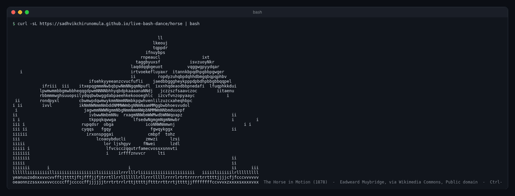
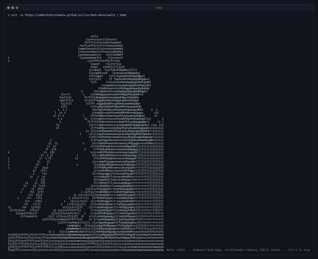
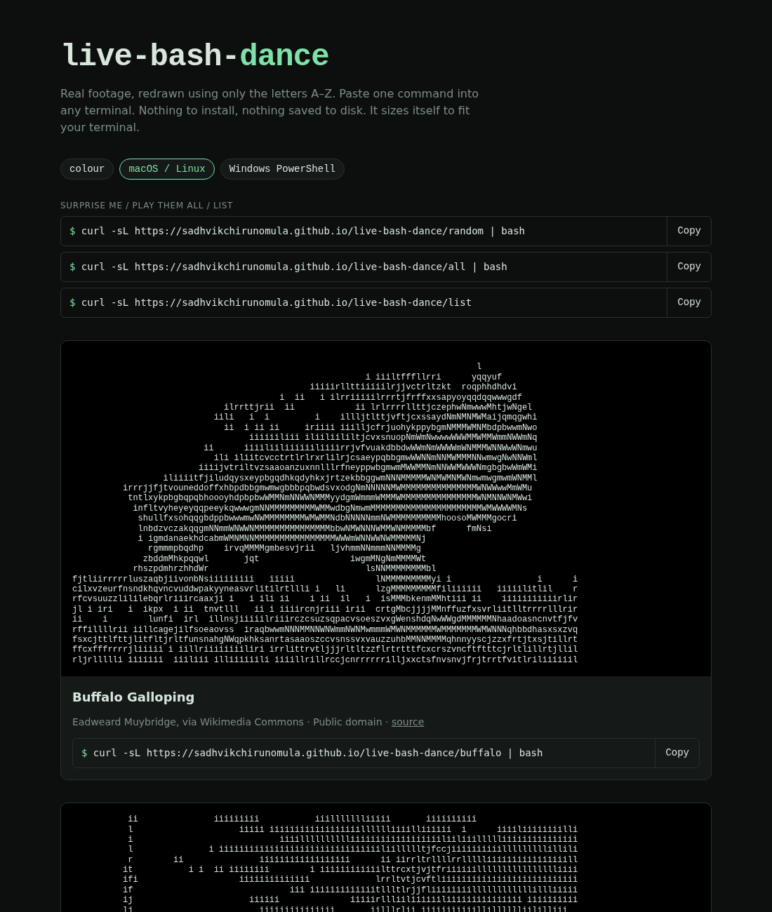

# live-bash-dance

Lifelike terminal animations drawn using **only letters**, from real video. One command, nothing to install:

```bash
curl -sL https://sadhvikchirunomula.github.io/live-bash-dance/horse | bash
```

See everything available with `curl -sL https://sadhvikchirunomula.github.io/live-bash-dance/list`. Get a different animation
each run from `/random`, or watch them all in turn, a few seconds each, with `/all`.

<p align="center"></p>

| `/waltz` in a terminal | the web gallery |
|---|---|
|  | <a href="https://sadhvikchirunomula.github.io/live-bash-dance/"></a> |

Press Ctrl-C to stop. Options:

```bash
curl -sL https://sadhvikchirunomula.github.io/live-bash-dance/horse | bash -s -- --color --loops 3 --fps 15
```

| option | what it does |
|---|---|
| `--color` | colour version (needs a 256-colour terminal) |
| `--loops N` | play N times, then exit (default: forever) |
| `--fps N` | override the playback speed |
| `--width N` | cap the width in columns (default: the largest size that fits the terminal) |
| `--seconds N` | with `/all`: seconds per animation (default 6) |

On Windows, use PowerShell (5.1+, or PowerShell 7 on any OS):

```powershell
irm https://sadhvikchirunomula.github.io/live-bash-dance/horse.ps1 | iex
& ([scriptblock]::Create((irm https://sadhvikchirunomula.github.io/live-bash-dance/horse.ps1))) -Color -Loops 3
```

The parameters are `-Color`, `-Loops`, `-Fps`, `-Width` and `-Seconds`. `random.ps1` and `all.ps1` work too.

Inspired by `curl ascii.live/rick`, with one difference: ascii.live needs a running server. This project is
**fully static** and hosted free on GitHub Pages. Each URL serves a small script with the frames
inside it, and the script plays them on your machine. It makes no network calls, writes no files and runs no `eval`.
Open the URL in a browser to read it before you pipe it.

The same site has a browser gallery at `https://sadhvikchirunomula.github.io/live-bash-dance/`, with colour and bash/PowerShell toggles.

## Make your own animation

Full guide: **[HOW-TO-ADD.md](HOW-TO-ADD.md)**. Using [Claude Code](https://claude.com/claude-code)? Run
`/add-animation <clip> <name>` in this repo (also `/preview` and `/check`).

You need Node 18+ and `ffmpeg`.

```bash
node tools/convert.mjs dance.mp4 dance \
  --start 2 --duration 6 \
  --title "My Dance" --credit "Jane Doe" --license "CC BY 4.0" --source-url "https://..."
node tools/convert.mjs dance.mp4 dance --reconvert --gamma 2.5   # tweak one setting, keep the rest
npm run serve          # builds site/ and serves it on http://localhost:8000
curl -sL localhost:8000/dance | bash
```

Converter flags:

| flag | default | what it does |
|---|---|---|
| `--widths A,B,C` | 40,64,100 | sizes to generate, in columns (16–120 each) |
| `--width N` | | a single size instead |
| `--fps N` | source rate | playback rate (max 15) |
| `--start S`, `--duration D` | whole clip | trim the clip |
| `--invert` | off | use when the subject is dark on a light background |
| `--gamma G` | 1.8 | higher pushes the background toward blank |
| `--max-frames N` | 120 | hard cap, keeps scripts small |
| `--reconvert` | | reuse the settings saved in `meta.json`; flags you pass override them |

Tips: clips with a single subject on a plain background look best, and 3–8 second loops work well.
Try `--invert` both ways and pick whichever looks better. The names `list`, `random`, `all`, `index`, `frames`
and `data` are reserved.

## How it works

```
video/GIF --ffmpeg--> grayscale + colour frames --brightness->letter--> anims/<name>/<W>.txt + <W>.color.txt
anims/* --tools/build.mjs--> site/<name>, <name>.ps1 (players + frames), random, all, list, index.html (gallery)
push to main --GitHub Actions--> GitHub Pages
```

Letters are ordered by how much ink they use (` ilrtjfcvxzsunoaeykhdpqbgwmNWM`), so brightness maps to
letter density. Each cell also gets an xterm-256 colour for `--color`. Every animation is stored at several widths,
and the player picks the largest one that fits your terminal. The bash player uses only bash builtins plus `sleep`
and `tput`, and it works with the bash 3.2 that ships with macOS.

## Deploy your fork

1. Fork the repo or push it to GitHub.
2. Go to **Settings → Pages → Build and deployment → Source: GitHub Actions**.
3. Push to `main`. The workflow runs the checks, builds `site/` and publishes it.

Pull requests run the same checks, and PRs that touch `anims/` get a comment showing a still frame of each changed
animation.

## Layout

```
anims/<name>/<W>.txt        letter frames at width W, separated by @@FRAME@@ lines (committed)
anims/<name>/<W>.color.txt  colour grid: two hex digits (xterm-256 index) per cell
anims/<name>/meta.json      title, fps, frames, sizes, credit, license, sourceUrl, convert settings
tools/convert.mjs           video -> frames
tools/build.mjs             frames -> site/
tools/check.mjs             pre-PR checks (metadata, build, shellcheck, player smoke tests)
tools/player.template.sh    the bash player
tools/player.template.ps1   the PowerShell player
web/index.html              browser gallery
```

## License

Code: MIT. Each animation keeps the license of its source clip, listed in its `meta.json`.
The current animations (horse, waltz, dancer, buffalo, lion, mule) are Eadweard Muybridge's motion studies,
which are in the public domain.
